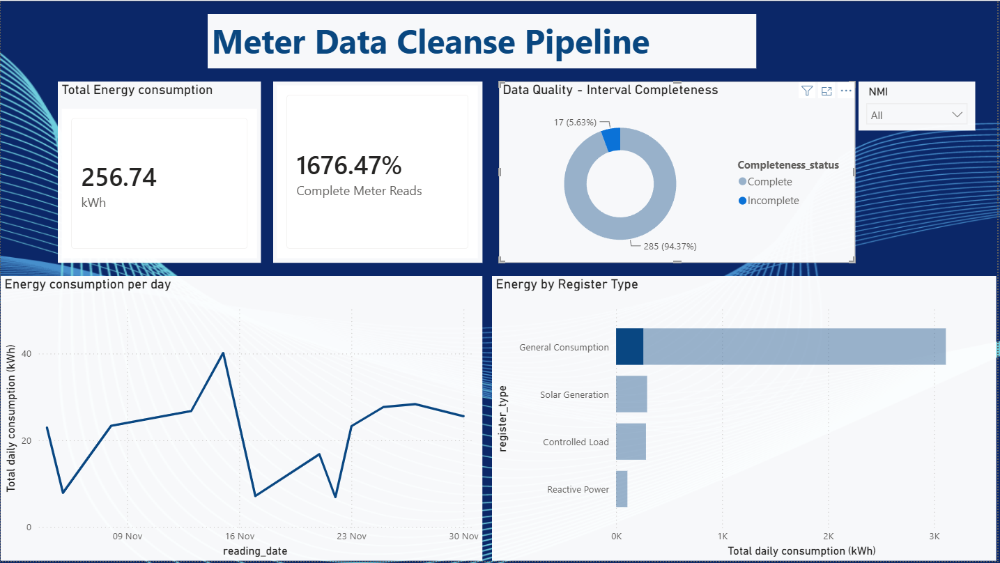

# NEM12 Meter Data Cleanse & Quality Pipeline

An end-to-end data pipeline that parses, cleanses, normalises, and analyses
Australian electricity interval meter data (**NEM12** format) — modelling the
data-quality and preparation work that an energy retail platform migration requires.



## Problem

NEM12 is the AEMO standard for interval meter data. The files are *semi-structured*
and awkward to work with:

- **Headerless** with multiple record types (100 header, 200 NMI/meter details,
  300 interval readings, 900 end) — each row type has a *different* column structure,
  so standard `pd.read_csv` fails.
- Readings arrive as **48 (30-min) or 96 (15-min) values per day**, with quality
  flags (A = actual, E = estimated, F = substituted).
- Real extracts contain data-quality issues: invalid NMIs, duplicate rows,
  negative/unparseable readings, and days with missing intervals.

Before this data can be migrated to a new platform, it must be parsed, cleansed,
validated, and structured. That preparation work is what this project models.

## Pipeline

```
Raw NEM12 files
   → Python parser (record-type-aware)
   → Cleanse & validate (exceptions routing)
   → Normalise to 3NF (dim_nmi, dim_meter, fact_reading)
   → BigQuery (Google Cloud)
   → SQL analytical views
   → Power BI dashboard
```

## Data

- `raw/real_sample_aemo_NEM12.csv` — a **real, publicly available** AEMO NEM12 sample
  file; the parser is validated against it (it includes a two-register E1Q1 config and
  reactive-power data that the parser handles correctly).
- `raw/extract_*.csv` — synthetic records in authentic NEM12 format, scaled for volume.

> Parser validated against a public AEMO NEM12 sample; dataset scaled with synthetic
> records in the same format for demonstration. Real customer meter data is
> privacy-protected and not publicly available.

## Key steps

**1. Parsing.** A custom line-by-line parser reads each record type and carries the
`200` (meter) context forward to its `300` (reading) rows, converting the
semi-structured file into a clean long-format table (one row per interval reading).
Standard CSV parsing cannot handle this — variable record structure requires a
record-type-aware approach.

**2. Cleanse.** Profiled the data first, then handled each issue: removed duplicates,
and **quarantined** invalid records into an exceptions report (with documented reasons)
rather than deleting them — mirroring real data-migration practice. Also flagged days
with incomplete interval sets. Clean and exception counts reconcile exactly against the
source: nothing quietly disappears.

**3. Normalisation.** Split the flat table into a 3NF model: `dim_nmi`, `dim_meter`
(with surrogate keys and foreign keys, modelling multi-register sites), and
`fact_reading` — the structured, migration-ready output.

**4. BigQuery + SQL.** Loaded the tables to Google BigQuery and built analytical views
that join the model and label register types (General Consumption / Solar Generation /
Controlled Load / Reactive Power).

**5. Dashboard.** Power BI connected to BigQuery, with a dimensional data model and a
`% Complete` DAX measure. Shows consumption by register type, daily trend, and the
data-quality completeness split.

## Notes on data handling

- The consumption trend is scoped to General Consumption registers; reactive power
  (kVArh) is a distinct measure from energy consumption (kWh) and is not summed into
  consumption totals.
- The public AEMO sample file carries historical (2004) dates, retained for parser
  validation but excluded from the consumption view so the trend reflects the
  demonstration period.

## Results

- Parsed **20,592** interval readings across real and synthetic files
- Quarantined **~1,470** records with documented exception reasons
- **~94%** of meter-days had complete interval data; incomplete days flagged
- Fully interactive dashboard on live BigQuery data

## Tech

Python (pandas) · SQL · Google BigQuery · Power BI

## Status

- [x] NEM12 parser (record-type-aware)
- [x] Cleanse layer (invalid NMIs, interval validation, negatives, duplicates, exceptions)
- [x] Normalisation to 3NF
- [x] BigQuery load
- [x] SQL analytical views
- [x] Power BI dashboard
